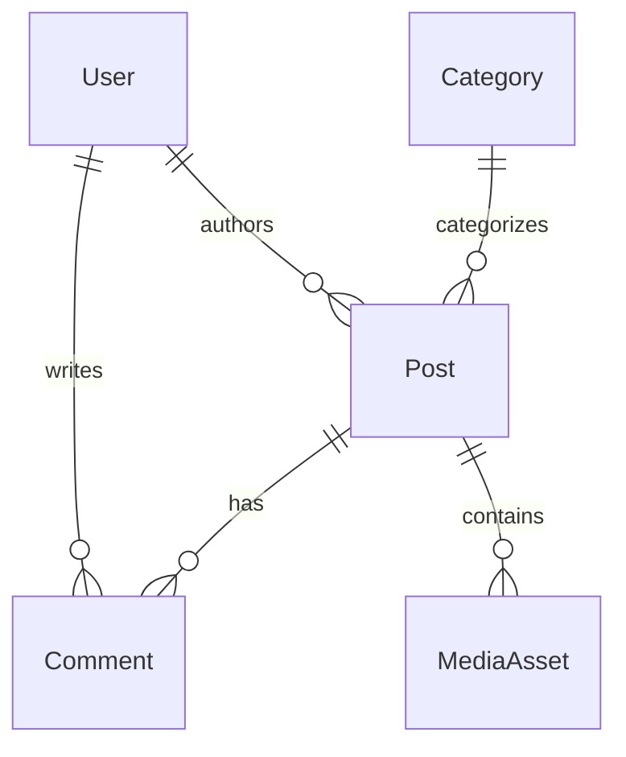

# Repository Overview

## Introduction

This document provides an extensive overview of the Driving Express application repository, summarizing key findings from the exploration of the entire repository and the Database Documentation. It includes technical concepts, entity relationships, and visual representations using Mermaid diagrams.

---

## 1. Project Structure

The repository is organized into several key directories and files, each serving a specific purpose in the development and functionality of the Driving Express application. The main components include:

- **Database Documentation**: Contains detailed information about the database schema, including tables, relationships, and data types.
- **Source Code**: The core application logic, including models, controllers, and views.
- **Assets**: Media files, images, and other static resources used in the application.
- **Configuration Files**: Settings and configurations for the application environment.

---

## 2. Database Overview

The Driving Express Database is designed to support a modern content and community platform. It manages various entities, including users, content, media assets, and user interactions.

### 2.1 Key Entities

- **User**: Represents registered users with attributes such as name, email, role, and preferences.
- **Post**: Represents content articles or posts with attributes like title, content, and metadata.
- **Category**: Organizes posts into hierarchical structures.
- **Comment**: Allows users to comment on posts, supporting threaded replies.
- **MediaAsset**: Stores information about uploaded media files.

### 2.2 Entity-Relationship Diagram

---

## 3. Key Business Processes

The application supports several key business processes, including:

- **User Management**: Registration, login, and profile management.
- **Content Creation & Management**: Writing, editing, and publishing posts.
- **Community Engagement**: Users can comment, review, and interact with content.
- **Analytics & Tracking**: Monitoring user behavior and content performance.

---

## 4. Technical Concepts

### 4.1 Data Types and Relationships

The database schema utilizes various data types, including:

- **UUID**: For unique identifiers.
- **String**: For textual data.
- **DateTime**: For timestamps.
- **JSON**: For flexible data structures.

### 4.2 Consent Management

The application includes a robust consent management system to track user consent for cookies and privacy regulations.

### 4.3 Advertising and Tracking

The database supports advertising models, including ad impressions and clicks, to track user interactions with advertisements.

---

## 5. Conclusion

This document serves as a comprehensive overview of the Driving Express application repository, highlighting the database structure, key entities, and business processes. The use of Mermaid diagrams provides a visual representation of the relationships between entities, aiding in understanding the overall architecture of the application. 

For further details, refer to the Database Documentation and source code files within the repository.