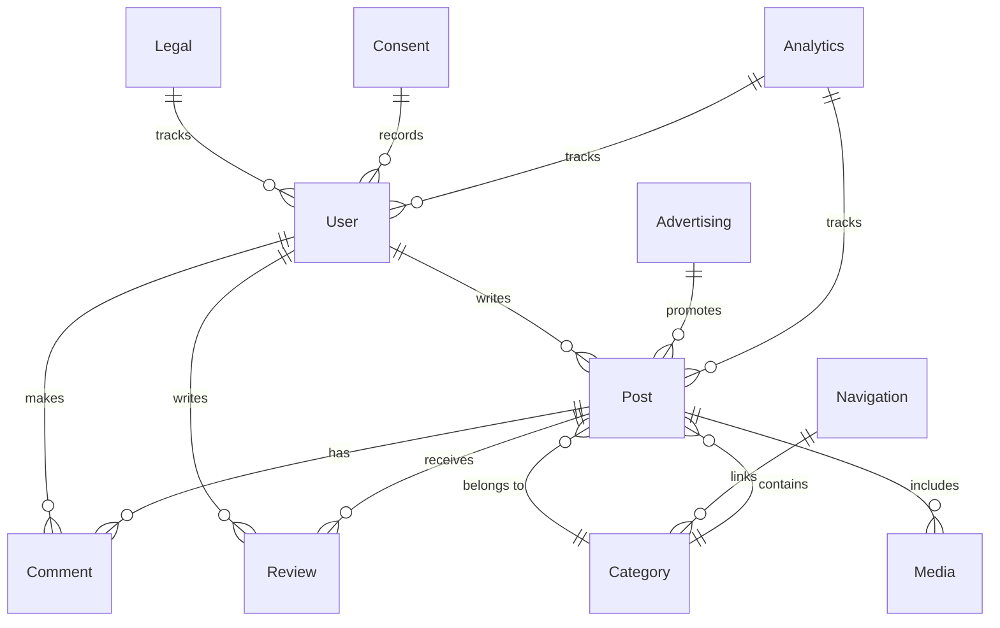
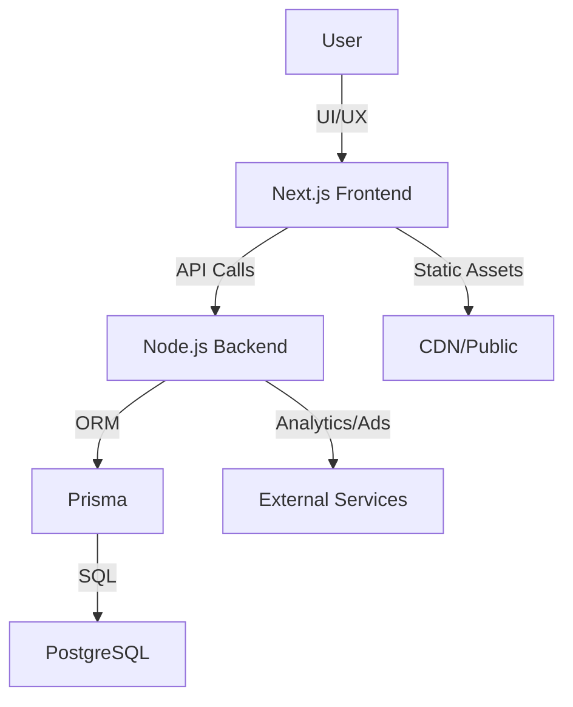
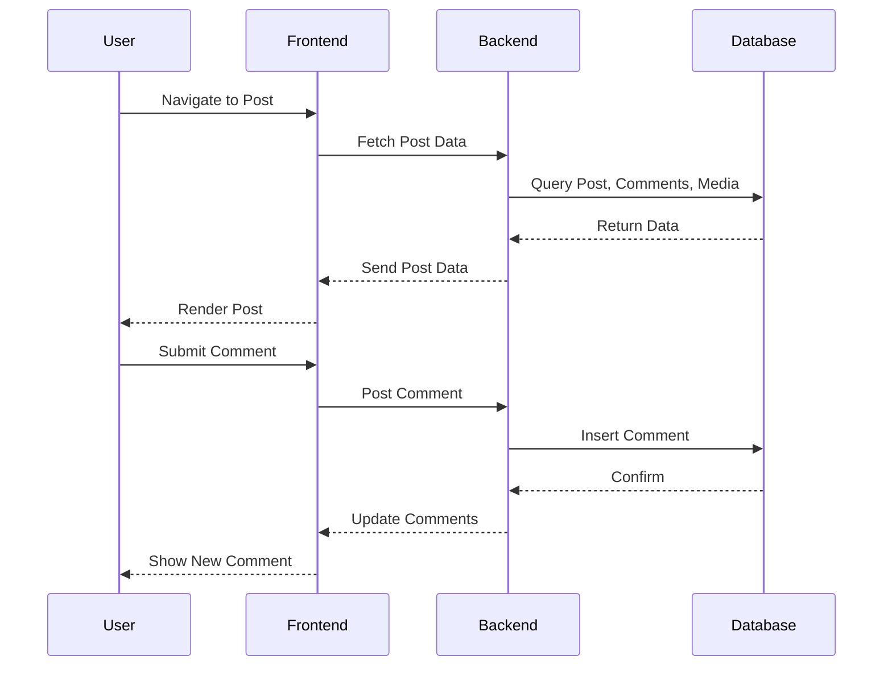

Here is the comprehensive Markdown document for your repository, ready to copy and use:

---

# Driving Express App: Comprehensive Codebase & Product Overview

---

## Table of Contents

1. Introduction
2. Product & User Experience Overview
3. Technical Architecture
4. Database Design & Entity Relationships
5. Main Features & User Flows
6. UI/UX & Component Structure
7. Technical Stack & Integrations
8. Business Logic & Processes
9. Mermaid Diagrams
10. Additional Insights

---

## Introduction

**Driving Express App** is a modern, full-stack web application designed to deliver a rich, content-driven experience for users interested in driving education, news, and community engagement. The platform leverages Next.js, Prisma, PostgreSQL, and a suite of modern UI libraries to provide a scalable, maintainable, and visually appealing product.

---

## Product & User Experience Overview

- **Target Users:** Learners, instructors, driving schools, and general public interested in driving-related content.
- **Core Value:** Centralized hub for driving news, educational resources, reviews, analytics, and community features.
- **Key Flows:**
  - Discover content by category or feature
  - Read and interact with posts (comments, reviews, sharing)
  - Navigate via dashboard and analytics
  - Engage with legal, consent, and advertising information

---

## Technical Architecture

- **Frontend:** Next.js (React), TypeScript, Tailwind CSS, shadcn/ui, Radix UI, Recharts, Swiper
- **Backend:** Node.js, Prisma ORM, PostgreSQL
- **Deployment:** Amazon AWS, with static and dynamic rendering
- **Directory Structure:**
  - app — Main Next.js app pages and routing
  - components — UI and layout components
  - prisma — Database schema and migrations
  - driving_express_app_V_01 — Legacy or API/backend logic

---

## Database Design & Entity Relationships

The database is designed to support a rich content model, user management, analytics, and business processes.

### Main Entities

- **User**: Authentication, roles, profile
- **Post**: Content, author, category, media
- **Category**: Organizes posts
- **Comment**: User-generated feedback on posts
- **Review**: Ratings and feedback
- **Media**: Images, videos, files
- **Navigation**: Menu and site structure
- **Legal/Consent**: Compliance tracking
- **Advertising**: Ad management
- **Analytics**: User and content metrics

### Entity Relationship Diagram (Mermaid)

---

## Main Features & User Flows

- **Dashboard:** Overview of user activity, analytics, and quick links
- **Analytics:** Visualizations of engagement, post performance, and user metrics
- **Features Page:** Highlighted content and platform capabilities
- **Category & Post Pages:** Browse and read content by topic
- **Comments & Reviews:** User engagement and feedback
- **Media Management:** Rich media in posts
- **Navigation:** Dynamic menus and category links
- **Legal & Consent:** User agreements and compliance
- **Advertising:** Targeted content and promotions

---

## UI/UX & Component Structure

- **Header, Footer, Sidebar:** Consistent navigation and branding
- **SevenPostsSection, VerticalSlider, MaterialSlider:** Dynamic content displays
- **NewsCard, CategoryHeader, SubCategorySection:** Modular content presentation
- **ShareButton, SideRelatedCard:** Social and related content features
- **Toasts, Loaders, Spinners:** Feedback and loading states
- **Tabs, Cards, Accordions:** Interactive UI elements
- **SEO Config:** Dynamic metadata for discoverability

---

## Technical Stack & Integrations

- **Next.js:** App directory routing, SSR/SSG, API routes
- **Prisma:** Type-safe ORM for PostgreSQL
- **PostgreSQL:** Relational database
- **Tailwind CSS:** Utility-first styling
- **shadcn/ui, Radix UI:** Accessible, customizable UI primitives
- **Recharts, Swiper:** Data visualization and carousels
- **Other:** Custom hooks, dummy data, theme provider

---

## Business Logic & Processes

- **User Registration & Authentication:** Role-based access, consent tracking
- **Content Management:** CRUD for posts, categories, media
- **Engagement:** Comments, reviews, sharing
- **Analytics:** Track user actions, post performance
- **Advertising:** Manage and display ads
- **Legal Compliance:** Record and enforce user consent

---

## Mermaid Diagrams

### High-Level System Architecture

### User Flow Example: Reading & Commenting on a Post

---

## Additional Insights

- **Separation of Concerns:** Clear distinction between frontend, backend, and database logic
- **Scalability:** Modular components and schema support future features
- **Accessibility:** Use of accessible UI libraries (Radix UI)
- **SEO:** Dynamic metadata and sitemap generation
- **Testing & Dummy Data:** Example data for development and testing
- **Legacy Support:** driving_express_app_V_01 folder for migration or API logic

---

## References

- See Database-documentation.md, schema.prisma, TECHNICAL-OVERVIEW.md, and codebase for further details.

---

\_Generated on 2025-06-03
