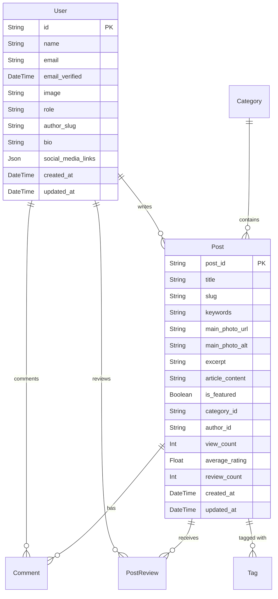

# Repository Overview

## Introduction

This document provides a comprehensive overview of the Driving Express application repository, focusing on the database structure, key components, and technical concepts. It compiles findings from the exploration of the entire repository and the `Database-documentation.md` file, including visual representations using Mermaid diagrams.

## Table of Contents

1. Database Overview
   - Purpose of the Database
   - High-level Description of the System/Application
   - Key Business Processes and Use Cases
2. Entity-Relationship Diagram
3. Table Descriptions
4. Technical Concepts
5. Conclusion

---

## 1. Database Overview

### 1.1 Purpose of the Database

The Driving Express Database is designed to support a modern, feature-rich content and community platform. It manages various entities such as users, content, categorization, user interactions, media assets, and more.

### 1.2 High-level Description of the System/Application

The database underpins a dynamic web application that serves as a publishing platform with robust user engagement features, including content creation, user account management, and analytics.

### 1.3 Key Business Processes and Use Cases

- User Management
- Content Creation & Management
- Content Consumption
- SEO & Content Discovery
- Community Engagement
- Personalization
- Media Management
- Site Administration
- Consent Management
- Advertising
- Analytics & Tracking
- Support & Communication

---

## 2. Entity-Relationship Diagram

---

## 3. Table Descriptions

This section provides a brief overview of the key tables in the database schema:

- **User**: Stores information about registered users, including their roles and preferences.
- **Post**: Contains the main content articles or posts, including metadata for SEO and user engagement.
- **Comment**: Manages user comments on posts, supporting threaded replies.
- **PostReview**: Records user reviews and ratings for posts.
- **Category**: Organizes posts into hierarchical categories.

---

## 4. Technical Concepts

### 4.1 Database Relationships

The database employs various relationships to manage interactions between entities:

- **One-to-Many**: A user can write multiple posts, and a post can have multiple comments.
- **Many-to-Many**: Posts can be tagged with multiple tags, and tags can be associated with multiple posts.

### 4.2 Data Types

The schema utilizes various data types, including:

- **String**: For textual data such as names and titles.
- **DateTime**: For timestamps related to creation and updates.
- **Json**: For flexible data storage, such as social media links and metadata.

---

## 5. Conclusion

The Driving Express application repository is structured to support a comprehensive content management system with a focus on user engagement and data integrity. The database design facilitates efficient data handling and provides a robust foundation for the application's features. 

This document serves as a guide for understanding the repository's architecture and the underlying database schema. Further exploration of individual components can provide deeper insights into the system's functionality.