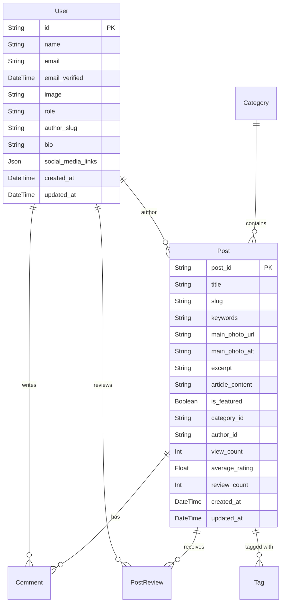

# Repository Overview

## Introduction

This document provides an extensive overview of the Driving Express application repository, focusing on the database structure, key components, and technical concepts. It compiles findings from the exploration of the entire repository and the `Database-documentation.md` file, including visual representations using Mermaid diagrams.

---

## 1. Database Overview

### 1.1 Purpose of the Database

The Driving Express Database supports a modern content and community platform, managing various entities such as users, content, interactions, and advertising.

### 1.2 High-level Description of the System/Application

The database underpins a dynamic web application that serves as a publishing platform with robust user engagement features, including content creation, user management, and analytics.

### 1.3 Key Business Processes and Use Cases

- User Management
- Content Creation & Management
- Content Consumption
- SEO & Content Discovery
- Community Engagement
- Personalization
- Media Management
- Site Administration
- Consent Management
- Advertising
- Analytics & Tracking
- Support & Communication

---

## 2. Entity-Relationship (ER) Diagram

---

## 3. Key Models and Their Relationships

### 3.1 User Model

- **Purpose:** Stores information about registered users.
- **Relationships:** 
  - One-to-Many with `Post`, `Comment`, `PostReview`, etc.

### 3.2 Post Model

- **Purpose:** Stores the main content articles or posts.
- **Relationships:** 
  - Many-to-One with `User` (author).
  - One-to-Many with `Comment`, `PostReview`, etc.
  - Many-to-Many with `Tag`.

### 3.3 Category Model

- **Purpose:** Organizes posts into hierarchical categories.
- **Relationships:** 
  - One-to-Many with `Post`.

---

## 4. Technical Concepts

### 4.1 Data Types

- **UUID:** Universally Unique Identifier for primary keys.
- **TIMESTAMPTZ:** Timestamp with time zone for date and time fields.
- **JSON:** Flexible data type for storing structured data.

### 4.2 Enums

- **UserRole:** Defines user roles such as subscriber, admin, editor, etc.
- **LegalDocumentVersionStatus:** Manages the status of legal documents.

---

## 5. Conclusion

This document serves as a comprehensive overview of the Driving Express application repository, detailing the database structure, key models, and technical concepts. The use of Mermaid diagrams provides a visual representation of the relationships between entities, enhancing the understanding of the system's architecture.